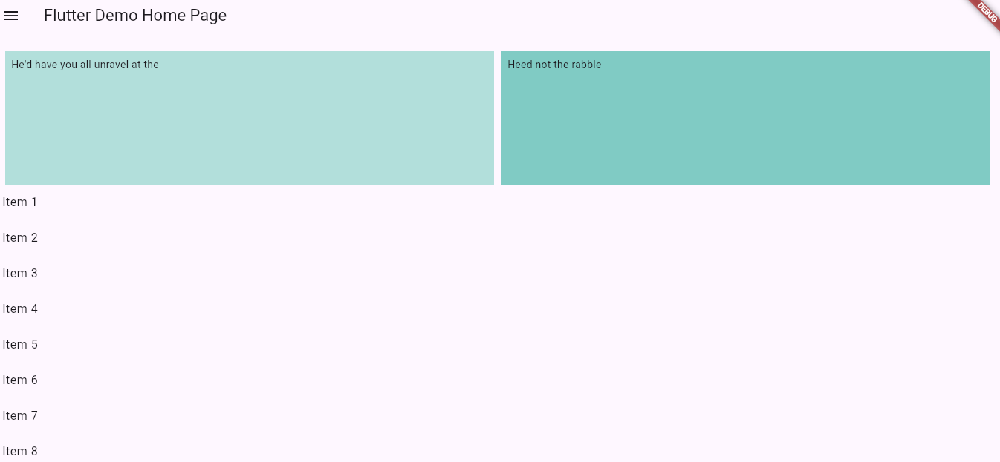

แน่นอน! นี่คือตัวอย่างไฟล์ `README.md` ที่ตกแต่งด้วยอิโมจิและมีลูกเล่นต่างๆ สำหรับโปรเจ็คของคุณเป็นภาษาไทย:

---

# 📱 แอปพลิเคชัน Flutter Demo

🎉 ยินดีต้อนรับสู่ **แอปพลิเคชัน Flutter Demo**! โปรเจ็คนี้เป็นตัวอย่างการใช้งานวิดเจ็ตต่างๆ ของ Flutter รวมถึงหน้าโฮม, เมนู Drawer สำหรับการนำทาง และ Bottom Sheet Modal 🚀

## 🌟 คุณสมบัติ

- 🏠 **หน้าโฮม**: หน้าโฮมที่เรียบง่าย มีการแสดงผลแบบ GridView และ ListView
- 📚 **เมนู Drawer สำหรับการนำทาง**: นำทางไปยังหน้า About Page และ GridListViews
- 📜 **Bottom Sheet Modal**: แสดง Bottom Sheet แบบโมดัลพร้อมข้อความและปุ่มปิด

## 📸 ภาพหน้าจอ

### หน้าโฮม


### เมนู Drawer


### Bottom Sheet Modal


## 🚀 เริ่มต้นใช้งาน

ทำตามขั้นตอนด้านล่างเพื่อเริ่มต้นใช้งานโปรเจ็คนี้:

1. **Clone โปรเจ็คนี้**:
    ```bash
    git clone https://github.com/yourusername/flutter_demo.git
    cd flutter_demo
    ```

2. **ติดตั้ง dependencies**:
    ```bash
    flutter pub get
    ```

3. **รันแอปพลิเคชัน**:
    ```bash
    flutter run
    ```

## 🔧 โครงสร้างโปรเจ็ค

```plaintext
flutter_demo/
├── lib/
│   ├── main.dart          # ไฟล์หลักของแอปพลิเคชัน
│   ├── drawer.dart        # เมนู Drawer สำหรับการนำทาง
│   ├── about_page.dart    # หน้า About Page
│   ├── grid_view_page.dart# หน้า GridView Page
│   └── bottom_sheet_page.dart # หน้า Bottom Sheet Modal
├── assets/
│   ├── images/            # ไฟล์รูปภาพต่างๆ
├── pubspec.yaml           # ไฟล์การตั้งค่าโปรเจ็คและ dependencies
└── README.md              # ไฟล์ README
```

## 👨‍💻 ผู้พัฒนา

- **ชื่อผู้พัฒนา**: [ชื่อผู้พัฒนา](https://github.com/yourusername)
- **อีเมล**: yourname@example.com

## 📄 ลิขสิทธิ์

โปรเจ็คนี้ได้รับอนุญาตภายใต้ MIT License - ดูไฟล์ [LICENSE](LICENSE) สำหรับรายละเอียดเพิ่มเติม

---

หวังว่าคุณจะพอใจกับ README ที่ตกแต่งเสร็จแล้วนี้! ถ้าคุณมีคำถามเพิ่มเติมหรือต้องการปรับปรุงเพิ่มเติม โปรดแจ้งให้ทราบได้เสมอ!
